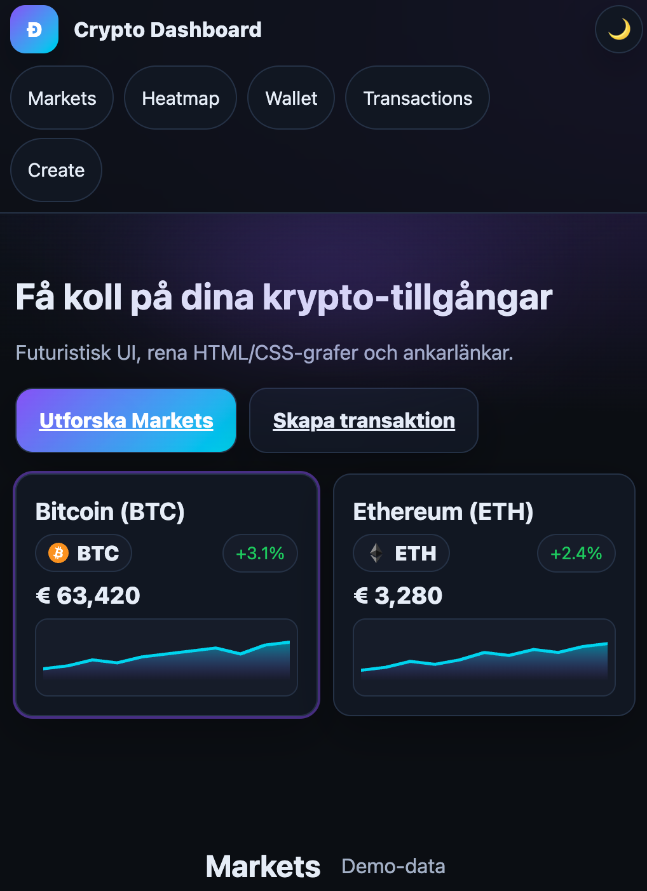
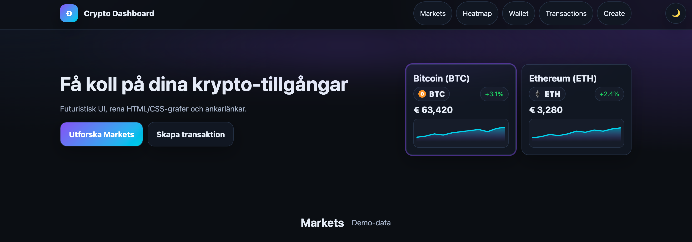
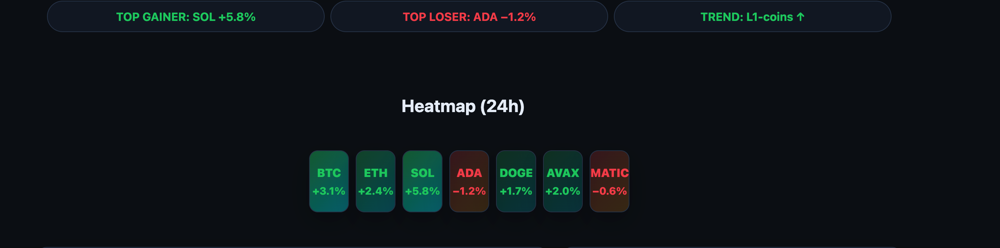
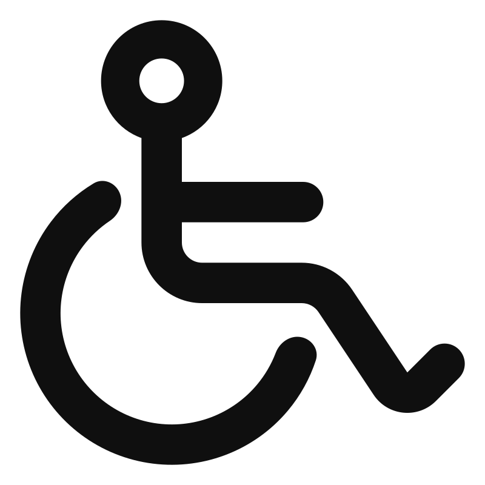

# Dashboard-html-css
**Utbildningsuppgift 2 — Crypto dApp Dashboard (HTML + CSS)**

Det här är min responsiva krypto dashboard byggd i **ren HTML och CSS** .
Jag använder demo data, ankarlänkar och stöd för **mörkt/ljust läge**.

---

## Vad som finns
- Meny med ankare: **Markets, Heatmap, Wallet, Transactions, Create**
- **Markets:** flera coins (BTC, ETH, SOL, ADA, DOGE, AVAX, MATIC) med mini-grafer (linje/staplar)
- **Heatmap:** färgplattor som visar 24h-förändring + logotyper
- **Wallet:** saldo, adress och nyckeltal
- **Transactions:** tabell med zebra/hover
- **Create:** formulär (demo) med tydliga focus-stilar

---

## Kör projektet
Öppna `index.html` i valfri webbläsare.  
Tips: Jag testar responsivitet och mörkt/ljust läge i **DevTools**.  

---

## Struktur
/projekt
- index.html
- styles.css
- assets/
- icons/ (SVG-logotyper för coins)

---

## Checklista
- Responsiv (mobil, tablet, desktop + stora skärmar)
- Ankarnavigation
- Wallet + transaktionstabell + formulär
- Mörkt/ljust läge
- Dummy-data och tydlig visuell hierarki

---

## Skärmdumpar
Lägg skärmbilder i `pictures/` och uppdatera länkarna nedan.

---

## Tillgänglighet
- Semantiska element (`header`, `main`, `nav`, `section`)
- Synliga `:focus`-markeringar + **skip-länk**
- Jag kör en snabb granskning i Lighthouse/axe och sparar rapportbild här:

---

## Notering
Detta är en **UI-demo** 